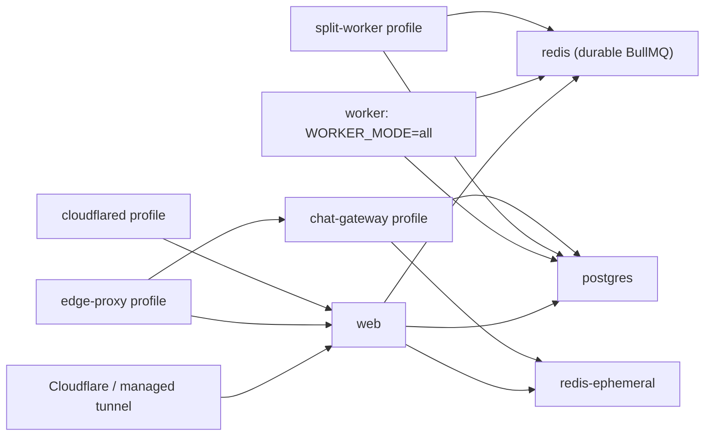

# Arctic RSS second-pass revalidation

## Phase 0 — Revalidate the audit and establish a clean baseline

### Status

Complete.

### Baseline

**Audited source:** `origin/main` at
`a033de2045bd3890b11c781bb4632589fbe25df1` (`Add publisher podcast
transcripts (#59)`).

**Working branch:** `codex/second-pass-phase-0`.

**Scope:** source and checked-in documentation only. No production mutation or
live production verification was performed. The checked-in production inventory
is a historical capture, not current deployment evidence.

- `origin/main` is exactly the plan's audit baseline: commit distance is `0 0`.
- There are no migrations or source changes after that baseline to reclassify.
- The ordinary `main` checkout was left untouched because it is 76 commits
  behind `origin/main` and contains unrelated uncommitted guest-OPML work.
- The existing production inventory records a previous `74ffd3f` release and
  must be reverified before any release; it is not evidence that this source
  revision is deployed.

### Changes implemented

- Created this source-based revalidation, the architecture map below, and the
  separate [baseline validation report](second-pass-baseline-validation.md).
- Classified every work-plan area without marking a finding fixed solely from
  historical documentation.

### Security impact

The confirmed P1 secret-boundary, worker-ownership, and maintenance-lease
findings remain unchanged; this phase introduces no runtime or production
security change.

### Operational impact

None. The existing production inventory remains historical evidence only and
no production host, service, or configuration was changed.

### Database/migration impact

None. All committed migrations were exercised only against a disposable local
database; the evidence is in the baseline validation report.

### Tests and commands run

See [second-pass-baseline-validation.md](second-pass-baseline-validation.md)
for the exact commands and results, including 1,054 passing tests, production
build, browser smoke, and disposable-database migration validation.

### Evidence

#### Declared architecture

This diagram reflects `docker-compose.yml`, not a runtime inspection.

The declared all-in-one worker has no profile, while every split worker is in
the `split-workers` profile. Enabling that profile consequently starts both
ownership models.

#### Finding revalidation

| Plan area | Classification | Current evidence |
| --- | --- | --- |
| Phase 1 — service-secret isolation | Confirmed P1 | `migrate`, `web`, `worker` (and therefore split workers), and `chat-gateway` use broad `env_file: .env`; production validation validates a shared environment rather than a role. |
| Phase 2 — canonical topology and CI | Confirmed P1 | Compose starts the unprofiled `worker` with `WORKER_MODE=all`; CI starts it again when it enables `split-workers`. There is no checked-in topology manifest or validator. |
| Phase 3 — renewable maintenance lease | Confirmed P1 | `worker/maintenance-lock.ts` acquires a five-minute `SET NX PX` lock and only compare-and-deletes it. There is no renewal or lease-loss path. |
| Phase 4A — Redis endpoint separation | Incomplete | Workloads use named durable/ephemeral URLs, but `REDIS_URL` and `redis://localhost:6379` are still silent fallbacks and production does not reject equal normalized endpoints. |
| Phase 4B — readiness and diagnostics | Incomplete | Public health checks PostgreSQL plus the durable queue only; worker health is a container-local `/tmp` mtime. There is no topology-aware doctor command or shared diagnostic service. |
| Phase 5 — authenticated browser journeys | Incomplete | E2E contains only public/CSP smoke coverage. No authenticated reader, OPML, search, settings, or revocation journey is present. |
| Phase 6 — reader query and hydration | Confirmed | `ReaderArticle` includes full text and sanitized HTML, and list loading calls `readerArticleInclude`; list mapping sanitizes each article body. The app shell remains a broad client component. |
| Phase 7 — transcript abuse controls | Confirmed | The authenticated transcript route calls the fetcher directly with no endpoint rate limit, global semaphore, or bounded temporary cache. Existing URL/content bounds remain in place. |
| Phase 8 — deletion and policy versions | Confirmed | Deletion requires a password and directs Google-only users to support. Deletion records use `ARCTICIRC_POLICY_VERSION`. |
| Phase 9 — search measurement | Partially implemented | The full-text migration adds GIN/trigram indexes, but the query recomputes its weighted vector and no representative `EXPLAIN (ANALYZE, BUFFERS)` report or latency target is checked in. |
| Phase 10 — product polish | Deferred | Correctly gated behind P1 and technical remediation. No implementation starts in Phase 0. |
| Phase 11 — structural refactoring | Deferred | No refactor should precede the behavior fixes it is meant to support. |
| Phase 12 — release package | Deferred | Existing guarded release tooling exists, but it cannot describe the new topology until the earlier phases land. |

#### Documentation drift

- `PROJECT.md` and `DEPLOYMENT.md` describe the older compact service list and
  omit the active durable/ephemeral split and optional chat/edge services.
- `README.md` is closer to Compose but still does not establish one supported,
  exclusive worker topology.
- `docs/operations/worker-queue-map.md` states that all-in-one and split
  workers must not run together, while the CI Compose invocation currently
  starts both. This is a source/CI contradiction, not a production claim.
- The roadmap says podcast transcripts are not started even though this
  baseline contains the publisher-transcript migration and route.

### Remaining risks

- The fixed-port Playwright suite remains blocked until the unrelated local
  listener on port 3000 is gone.
- Compose config validation remains blocked until it can use a safe local test
  environment or Phase 1 removes the broad `.env` injection.
- No live production verification was performed; fresh approval and runtime
  evidence are required before any release.

### Rollback

This phase changes documentation only. Revert the Phase 0 documentation commit
if the report needs to be withdrawn; no service, schema, or production rollback
is needed.

### Next phase gate

Pass. Phase 1 can now begin with the confirmed service-environment inventory
and explicit configuration allowlists.

## Phase 1 entry points

1. **Phase 1** is ready to implement: build an environment-read inventory,
   introduce explicit service allowlists, then add configuration-boundary tests.
2. **Phase 2** follows Phase 1, using one canonical topology source and a
   validator before changing CI launch commands.
3. **Phase 3** follows topology work because maintenance ownership must be
   described by the selected topology.

No production action is authorized by this report. Before a deployment, obtain
fresh runtime/backups/migration/topology evidence and the owner's explicit
release approval.
